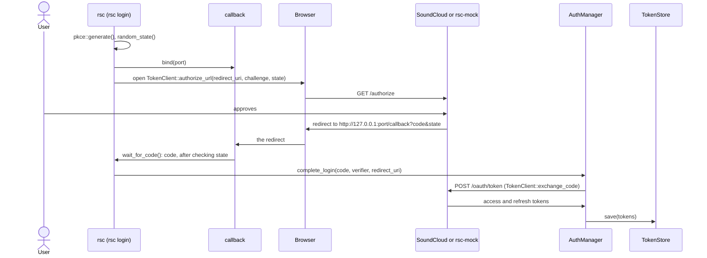

# Architecture

A short tour of the repository for someone who has just arrived. It says where things live and how
they fit together; the reasons behind the design are in [`rsc-mvp-plan.md`](../rsc-mvp-plan.md)
(French for now, see [`ROADMAP.md`](../ROADMAP.md)), and the details of the fake SoundCloud are in
[`specs/rsc-mock.md`](../specs/rsc-mock.md).

Each section says what exists today and what is only planned. Nothing here is a promise about names
that are not in the code yet.

## The two crates

The Cargo workspace (`Cargo.toml`) has two members:

- **`rsc`**: the terminal client (a library, `rsc/src/lib.rs`, and the `rsc` binary,
  `rsc/src/main.rs`).
- **`rsc-mock`**: a faithful fake of the SoundCloud API, so that `rsc` can be developed and tested
  without an official app (which needs an Artist Pro account). Today it is a library only
  (`rsc_mock::spawn`); the standalone binary is roadmap item 10.

## `rsc`: the modules

| Module | Role |
| --- | --- |
| `models` | Domain types shared by every backend: `Playlist`, `Track`, `StreamTarget`, `Access`. |
| `backend` | The `Backend` trait: where playlists and audio come from. `LocalBackend` reads a folder of audio files; the SoundCloud backend does not exist yet (roadmap item 13). |
| `player` | The `Player` trait, `MpvPlayer` (mpv driven over its JSON IPC socket) and `FakePlayer` for tests. |
| `queue` | `Queue`: the tracks to play, the current position, skipping. |
| `session` | `Session` ties a `Backend`, a `Player` and a `Queue` together and decides what plays next when the player reports an event. |
| `auth` | Everything about logging in and staying logged in. See the next section. |
| `api` | `ApiClient`: authenticated `GET` calls to the SoundCloud API. |
| `main.rs` | The command line (`clap`) and the terminal keyboard loop. Only the `playlists` and `play` commands exist, on the local backend. |

Two boundaries are deliberate:

- `Backend` and `Player` are traits, so `Session` is tested with fakes, without a network or mpv.
- A stream URL is asked for with `Backend::stream_target` just before a track plays, never when a
  playlist is loaded, because real stream URLs are short-lived.

## Logging in

### The building blocks (all in `rsc/src/auth/`, all implemented)

| File | What it does |
| --- | --- |
| `pkce.rs` | PKCE verifier and S256 challenge (`generate`, `challenge_for`) and the anti-CSRF `state` (`random_state`). |
| `callback.rs` | A listener on `http://127.0.0.1:<port>/callback` that receives the redirect and checks `state` (`bind`, `wait_for_code`, `parse_request_line`). |
| `client.rs` | `TokenClient`: builds the authorize URL and calls the token endpoint (`exchange_code`, `refresh`). |
| `tokens.rs` | `Tokens` (access token, refresh token, expiry). Their `Debug` output never contains the secrets. |
| `store.rs` | `TokenStore`: the tokens file (mode `0600`), written atomically (tmp file, fsync, rename). |
| `manager.rs` | `AuthManager`: `get_valid_token`, `refresh_after_unauthorized` and `complete_login`. |

`ApiClient::get_json` (`rsc/src/api/mod.rs`) sits on top: it asks `AuthManager` for a valid token,
and on an HTTP 401 it refreshes once and retries once. A second 401 means the user must log in again.

Refresh tokens are single-use, so losing one logs the user out for good. That is why `AuthManager`
refreshes under a lock, checks again once it holds it, and saves the new tokens to disk before
anyone can use them.

### The login sequence

Every step below exists as a function. Nothing calls them in this order yet: assembling them into a
command is **planned, roadmap item 12 (`rsc login`)**.

## How `rsc` and `rsc-mock` fit together

The design: one mock server (`rsc_mock::spawn(MockConfig)`, then `MockServer::base_url()`) answers
both the authorization endpoints (`/authorize`, `/oauth/token`) and, in later slices, the API
endpoints. `rsc` never has a hard-coded host: `TokenClient::new(auth_base, ..)` and
`ApiClient::new(api_base, ..)` take their base URLs as arguments. Pointing both at the mock, instead
of `https://secure.soundcloud.com` and `https://api.soundcloud.com`, is all it takes to develop
against it.

Where that stands:

- **Implemented**: the OAuth part of the mock (`rsc-mock/src/oauth/`), with a manual clock so tests
  never sleep (`MockServer::advance_clock`).
- **Not wired yet**: `rsc`'s own tests still use `wiremock` (see `rsc/src/test_support.rs`), and no
  command reads a base URL from the command line or the environment. Both come with `rsc login`
  (roadmap item 12). The names of the options are not decided.
- **Not written yet**: the API, media and fault-injection slices of the mock (roadmap items 8 to 10).
- **Known gap**: `TokenClient` reads RFC-style `{"error": ...}` bodies, while SoundCloud and the
  mock answer `{"code", "message", "link"}` (roadmap item 6).

## `rsc-mock`: the modules

| Module | Role |
| --- | --- |
| `server` | The HTTP server, its shared state, and the `MockServer` handle. |
| `config` | `MockConfig`, `RegisteredClient` and `UserDecision` (what the fake user does at `/authorize`). |
| `oauth` | The authorization server: `authorize.rs` (`GET /authorize`), `token.rs` (`POST /oauth/token`), `client_auth.rs` and `store.rs` (codes, tokens, and the families that let a replayed code revoke what it produced). |
| `pkce`, `clock`, `error`, `form`, `response` | PKCE verification, the manual clock, SoundCloud-shaped errors, form decoding, response helpers. |

## Where the tests are

- Unit tests sit next to the code they cover, in a `tests.rs` file inside the module's folder
  (`rsc/src/auth/manager/tests.rs`), never inline.
- `rsc/tests/` holds the integration and end-to-end tests (real mpv, real binary, pseudo-terminal,
  signals); the README's [Development](../README.md#development) section describes the layers.
- `rsc-mock/tests/` tests the mock through its public API.
- Behavior changes follow the SPEC / DEV / TEST workflow of [`specs/README.md`](../specs/README.md).
